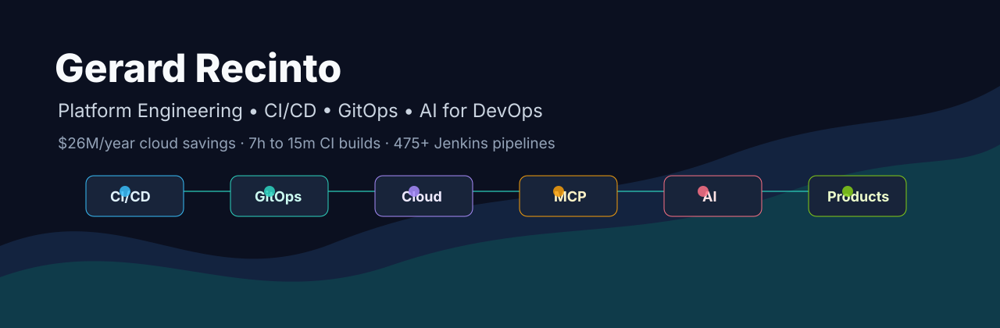

# Gerard Recinto

Senior Software Engineer in San Diego building CI/CD systems, cloud platform tooling, and AI-assisted developer infrastructure.

I turn messy operational systems into products: build farms, GitOps workflows, MCP servers, artifact platforms, and automation that saves time, money, and incident response effort.

---

## What I Build

| Product Direction | Repos | Why It Matters |
|---|---|---|
| AI for DevOps | [devops-mcp](https://github.com/gerardrecinto/devops-mcp), [devopsledger](https://github.com/gerardrecinto/devopsledger) | Give engineers natural-language access to CI, cloud, GitOps, incidents, risk, approvals, and rollback context. |
| CI/CD Platform Engineering | [platform-toolkit](https://github.com/gerardrecinto/platform-toolkit), [groovylibrary](https://github.com/gerardrecinto/groovylibrary) | Reusable pipeline engines, Jenkins shared libraries, artifact workflows, and failure triage patterns. |
| Enterprise Infrastructure | [Terraform](https://github.com/gerardrecinto/Terraform), [azure-infrastructure](https://github.com/gerardrecinto/azure-infrastructure), [argocd-gitops](https://github.com/gerardrecinto/argocd-gitops) | Practical IaC and GitOps examples for Kubernetes, cloud landing zones, and multi-cluster delivery. |
| AI Consumer Apps | [singing-coach-ai](https://github.com/gerardrecinto/singing-coach-ai), [singing-coach-ios](https://github.com/gerardrecinto/singing-coach-ios), [robo-trainer-mcp](https://github.com/gerardrecinto/robo-trainer-mcp) | Audio, training, and coaching products that can become paid apps or API-backed services. |

---

## Selected Impact

- **$26.28M/year** in S3 cost savings by tiering 9 PB of data to Glacier Deep Archive.
- **CI build time 6h59m to 15 min** by moving large binary assets from Git LFS to Artifactory with multi-threaded Python.
- **Release cycle 2+ hours to 5 min**, and MTTR **30 min to 2 min** through rollback automation.
- **475+ Jenkins pipelines** across 10+ product lines and 5 global regions.
- Built MCP tooling that connects AI assistants to engineering systems like GitHub, Jenkins, Kubernetes, AWS, Grafana, Jira, and Confluence.

---

## Current Startup Bets

| Bet | Wedge | First Customer |
|---|---|---|
| DevOpsLedger | Decision records for infra changes, rollback readiness, and change-risk memory. | Platform teams with change review pain. |
| DevOps MCP | Natural-language control plane for engineering operations. | DevOps teams drowning in dashboards and runbooks. |
| Singing Coach AI | Upload a recording and get actionable vocal coaching feedback. | Singers, creators, voice coaches, music schools. |
| Robo Trainer MCP | AI training assistant with structured coaching memory. | Strength athletes and personal trainers. |

More detail: [Monetization Map](docs/monetization-map.md)

---

## Portfolio Demo

---

## Tools & Experience

| Tool | Years | Where It Shows |
|---|---:|---|
| Python | 8 | [platform-toolkit](https://github.com/gerardrecinto/platform-toolkit), [devops-mcp](https://github.com/gerardrecinto/devops-mcp), [devopsledger](https://github.com/gerardrecinto/devopsledger) |
| Jenkins / Groovy | 8 | [groovylibrary](https://github.com/gerardrecinto/groovylibrary), [jenkins-pipeline-reference-groovylibrary](https://github.com/gerardrecinto/jenkins-pipeline-reference-groovylibrary) |
| Kubernetes | 7 | [Terraform](https://github.com/gerardrecinto/Terraform), [gpu_app_deployments](https://github.com/gerardrecinto/gpu_app_deployments), [argocd-gitops](https://github.com/gerardrecinto/argocd-gitops) |
| Terraform | 6 | [Terraform](https://github.com/gerardrecinto/Terraform), [azure-infrastructure](https://github.com/gerardrecinto/azure-infrastructure) |
| AWS / Azure / GCP | 6 | Cloud IaC, deployment automation, cost control, and platform reliability. |
| MCP / AI Tooling | 2 | [devops-mcp](https://github.com/gerardrecinto/devops-mcp), [robo-trainer-mcp](https://github.com/gerardrecinto/robo-trainer-mcp) |

---

## Good Reasons To Reach Out

- You want to turn DevOps knowledge, logs, incidents, and change history into an AI-readable operating layer.
- You need CI/CD, GitOps, Kubernetes, Terraform, Jenkins, or cloud platform consulting.
- You are exploring a startup around developer infrastructure, AI agents for operations, or coaching apps.
- You want to collaborate on one of the open-source projects above.

---

## GitHub Stats

